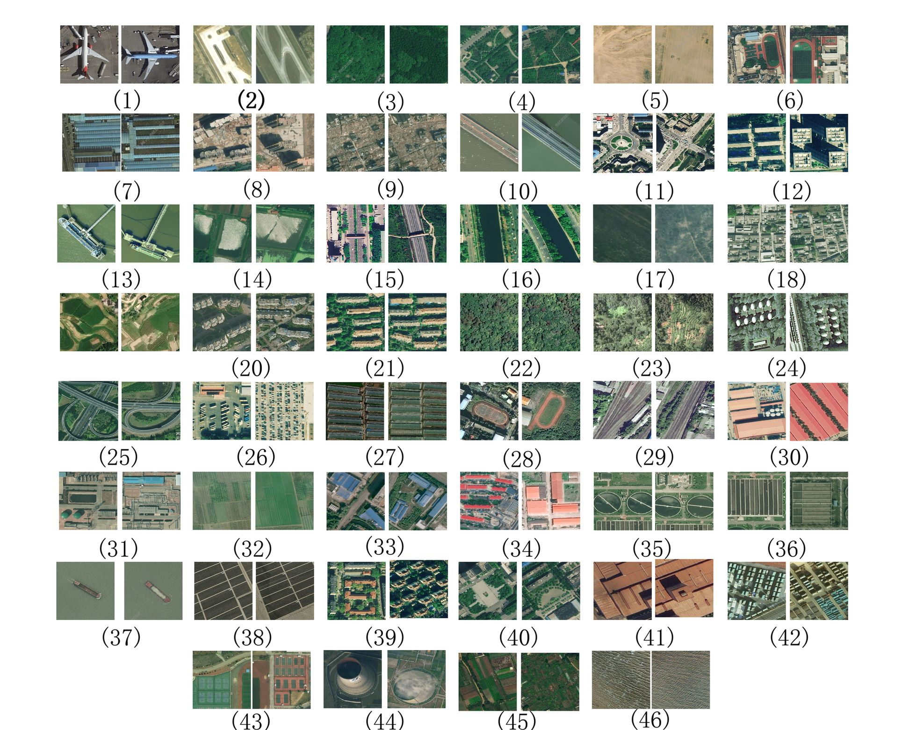

# RSD46-WHU

[Download](https://pan.baidu.com/s/1mMDKUu02V0s8rXstewv26A) the dataset

RSD46-WHU is a larget-scale open dataset for scene classification in remote sensing images. The dataset is collected from Google Earth and Tianditu. The ground resolution of most classes is 0.5m, and the others are about 2m. There are 500-3000 images in each class. The RSD46-WHU dataset has a number of 11,7000 images with 46 classes.

RSD46-WHU is free for education, research and commercial use.

Please cite our paper if the dataset is useful for you. Thank you!

1.Y. Long, Y. Gong, Z. Xiao and Q. Liu, "Accurate Object Localization in Remote Sensing Images Based on Convolutional Neural Networks," in IEEE Transactions on Geoscience and Remote Sensing, vol. 55, no. 5, pp. 2486-2498, May 2017. doi: 10.1109/TGRS.2016.2645610

2.High-Resolution Remote Sensing Image Retrieval Based on CNNs from a Dimensional Perspective, Zhifeng Xiao, Yang Long, Deren Li, Chunshan Wei, Gefu Tang, Junyi Liu. Remote Sensing, 9(7), 2017.

(1) Airplane

(2) Airport

(3) Artificial dense forest land

(4) Artificial sparse forest land

(5) Bare land

(6) Basketball court

(7) Blue structured factory building

(8) Building

(9) Construction site

(10) Cross river bridge

(11) Crossroads

(12) Dense tall building

(13) Dock

(14) Fish pond

(15) Footbridge

(16) Graff

(17) Grassland

(18) Low scattered building

(19) Lrregular farmland

(20) Medium density scattered building

(21) Medium density structured building

(22) Natural dense forest land

(23) Natural sparse forest land

(24) Oil tank

(25) Overpass

(26) Parting lot

(27) Plastic greenhouse

(28) Playground

(29) Railway

(30) Red structured factory building

(31) Refinery

(32) Regular farmland

(33) Scattered blue roof factory building

(34) Scattered red roof factory building

(35) Sewage plant-type-one

(36) Sewage plant-type-two

(37) Ship

(38) Solar power station

(39) Sparse residential area

(40) Square

(41) Steelworks

(42) Storage land

(43) Tennis court

(44) Thermal power plant

(45) Vegetable plot

(46) Water
